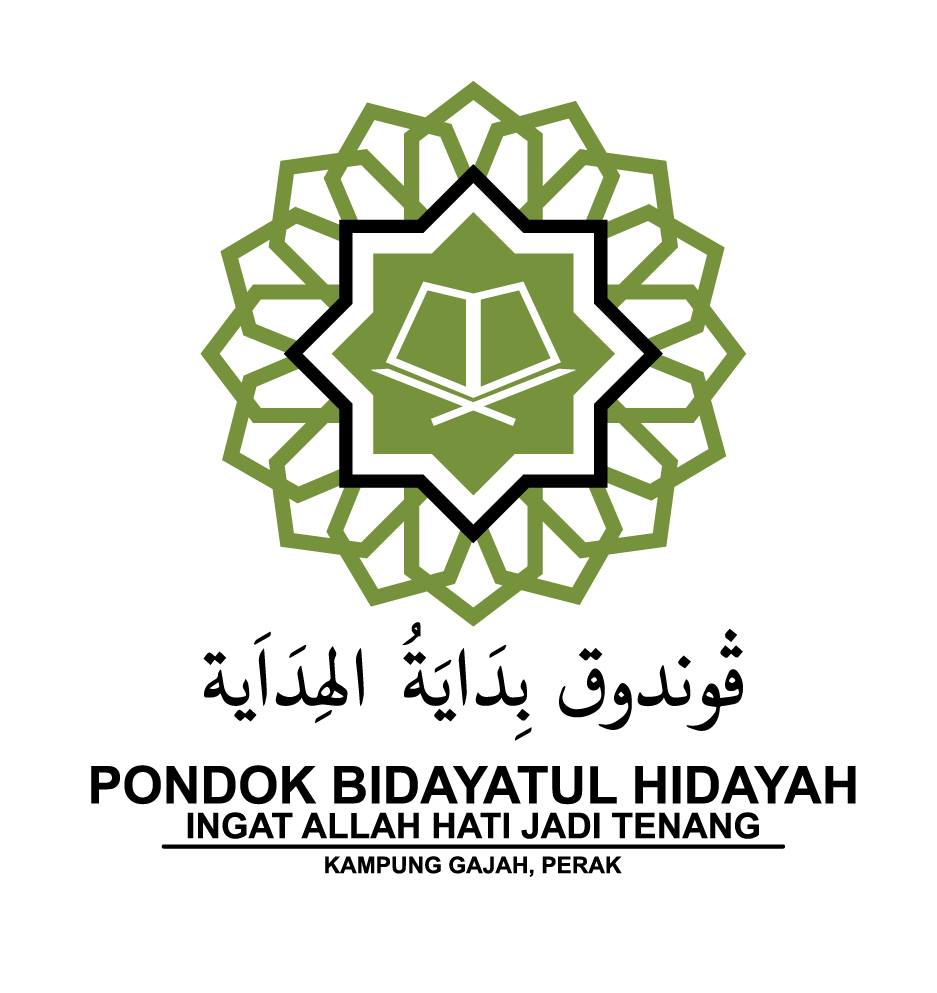

# Pondok Bidayatul Hidayah Website

A responsive Islamic educational institution website for Pondok Bidayatul Hidayah featuring program information and contact details.



## Overview

This website serves as an informational platform for Pondok Bidayatul Hidayah (فوندوق بداية الهداية), an Islamic educational institution. The site presents the organization's various educational programs, their details, and contact information in a clean, responsive layout with Islamic-inspired design elements.

## Features

- **Responsive Design**: Optimized for desktop, tablet, and mobile devices
- **Modern Islamic Aesthetic**: Incorporates traditional Islamic geometric patterns and color scheme
- **Animated Content**: Program information boxes enter the screen with smooth animations as users scroll
- **WhatsApp Integration**: Direct contact button for easy communication
- **Social Media Links**: Integration with social platforms

## File Structure

```
pondok-bidayatul-hidayah/
├── index.html              # Main HTML file
├── assets/
│   ├── css/
│   │   └── style.css       # Main stylesheet
│   ├── js/
│   │   └── script.js       # JavaScript functionality
│   └── img/
│       └── logo.png        # Logo image
└── README.md               # This documentation file
```

## Setup Instructions

1. **Clone or download** the repository to your local machine
2. **Update contact information**:
   - WhatsApp number in the HTML file (current: 011-2993 7487)
   - Social media links in the footer section
3. **Replace the logo** if needed (keep the same filename or update references)
4. **Deploy** to your preferred web hosting service

No special server requirements - this is a static HTML website that can be hosted on any standard web server or hosting platform.

## Customization

### Changing Colors

The color scheme can be modified in the `assets/css/style.css` file by updating the CSS variables at the top:

```css
:root {
    --primary-green: #1A6A37;  /* Logo green */
    --secondary-green: #7D9C45; /* Logo outer green */
    /* Other color variables... */
}
```

### Modifying Programs

To add, remove, or update programs, edit the `<div class="program-card">` sections in `index.html`. Each program follows the same structure, so you can duplicate or modify existing sections.

### Changing Contact Information

Update contact details in both the footer section and the WhatsApp button link:

```html


    HUBUNGI: EN. TAUFIQ - 011-2993 7487


```

## Browser Compatibility

The website is compatible with:
- Chrome (latest)
- Firefox (latest)
- Safari (latest)
- Edge (latest)
- Mobile browsers (iOS Safari, Android Chrome)

## Islamic Pattern Attribution

The Islamic geometric patterns used in this website are inspired by traditional Islamic art and architecture.

## Contact

For questions about this website template, contact the developer through the original repository.

For inquiries about Pondok Bidayatul Hidayah programs, contact:
- Phone/WhatsApp: 011-2993 7487
- Address: Lot 169, Kg Bt Hitam, 36800 Kg Gajah, Perak